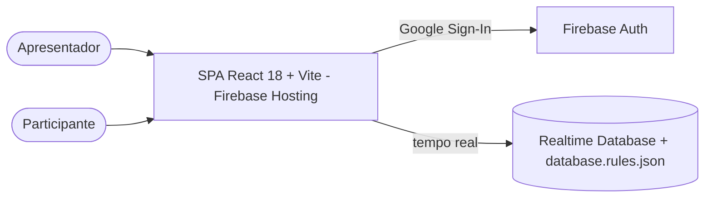
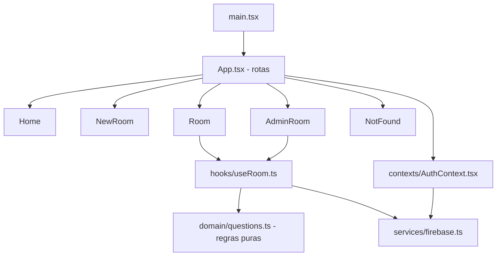

# Arquitetura — Letmeask

## 1. C4





Não há servidor próprio: a regra de negócio de autorização vive em `database.rules.json`, que é o "back-end" do projeto. Por isso o grupo da rubrica é fullstack.

## 2. Modelo de dados

```
rooms/{roomId}
  title: string (1..100)      authorId: uid (imutável)
  createdAt: TIMESTAMP        endedAt?: TIMESTAMP
  questions/{questionId}
    content (1..1000)  author {name, avatar}  authorId  createdAt
    isAnswered  isHighlighted
    likes/{likeId} { authorId }
```

## 3. Matriz de permissões (regras)

| Ação | Visitante | Participante | Dono |
|---|---|---|---|
| Ler uma sala | ✅ | ✅ | ✅ |
| Listar todas as salas | ❌ | ❌ | ❌ |
| Criar sala | ❌ | ✅ (como dono) | — |
| Perguntar | ❌ | ✅ em nome próprio, sala aberta | ✅ |
| Curtir / descurtir | ❌ | ✅ só a própria curtida | ✅ |
| Destacar, responder, remover, encerrar | ❌ | ❌ | ✅ |

## 4. ADRs

| # | Decisão | Motivo | Alternativa rejeitada |
|---|---|---|---|
| ADR-01 | Vite 8 + Vitest no lugar de CRA 4 + node-sass | CRA descontinuado, node-sass não compila no Node 20, alertas de audit herdados | Atualizar react-scripts (também descontinuado) |
| ADR-02 | Manter Firebase compat (v11) | Menor mudança no código; API modular fica para o próximo ciclo | Migrar tudo para API modular agora |
| ADR-03 | Datas com `ServerValue.TIMESTAMP` | Ordem confiável e não manipulável | `new Date()` no cliente |
| ADR-04 | Diálogo nativo `<dialog>` próprio (ConfirmDialog) | Acessível, sem dependência | react-modal / `confirm()` |
| ADR-05 | Testes de regras com `@firebase/rules-unit-testing` + emulador | Regras são a camada de segurança | Confiar só na interface |
